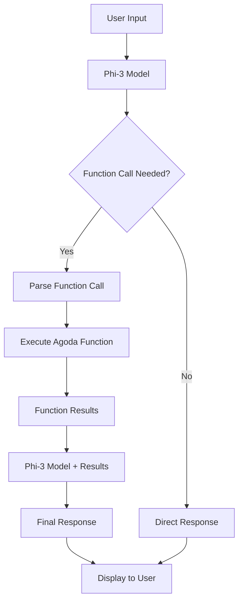

# Phi-3 Function Calling Chat App

A sample chat application using Microsoft's Phi-3 model with Agoda function calling capabilities.

## Installation & Run

```bash
# Install dependencies
poetry install

# Run the chat app
poetry run python run.py
```

## What it does

Interactive chatbot that can call Agoda functions to fetch:
- Policy information (privacy, customer, cancellation, payment)
- Booking details by ID  
- Hotel deals by destination

## How it works



## Examples

- "What's Agoda's privacy policy?" → Calls `fetch_policy("privacy")`
- "Check my booking AG123456" → Calls `fetch_booking_info("AG123456")`
- "Show me Bangkok deals" → Calls `get_hotel_deals("Bangkok")`
